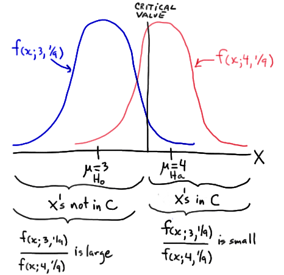
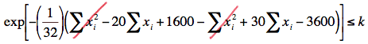
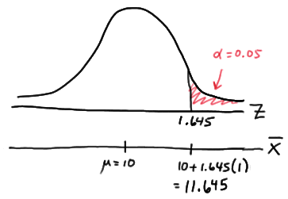

# Neyman-Pearson Lemma 

As we learned from our work in the previous lesson, whenever we perform a hypothesis test, we should make sure that the test we are conducting has sufficient power to detect a meaningful difference from the null hypothesis. That said, how can we be sure that the T-test for a mean \(\mu\) is the "most powerful" test we could use? Is there instead a K-test or a V-test or you-name-the-letter-of-the-alphabet-test that would provide us with more power? A very important result, known as the Neyman-Pearson Lemma, will reassure us that each of the tests we learned in Section 7 is the most powerful test for testing statistical hypotheses about the parameter under the assumed probability distribution. Before we can present the lemma, however, we need to:

1. Define some notation
2. Learn the distinction between simple and composite hypotheses
3. Define what it means to have a best critical region of size \(\alpha\)

**Notation**

If \( X_1, X_2, ..., X_n \) is a random sample of size \( n \) from a distribution with probability density (or mass) function \( f(x; \theta) \), then the joint probability density (or mass) function of \( X_1, X_2, ..., X_n \) is denoted by the likelihood function \( L(\theta) \). That is, the joint p.d.f. or p.m.f. is:

\[ L(\theta) =L(\theta; x_1, x_2, ... , x_n) = f(x_1;\theta) \times f(x_2;\theta) \times ... \times f(x_n;\theta) \]

Note that for the sake of ease, we drop the reference to the sample \( X_1, X_2, ..., X_n \) in using \( L(\theta) \) as the notation for the likelihood function. We'll want to keep in mind though that the likelihood \( L(\theta) \) still depends on the sample data.

**Simple hypothesis**

If a random sample is taken from a distribution with parameter \( \theta \), a hypothesis is said to be a simple hypothesis if the hypothesis uniquely specifies the distribution of the population from which the sample is taken. Any hypothesis that is not a simple hypothesis is called a composite hypothesis.

**Example 1**

Suppose \( X_1, X_2, ..., X_n \) is a random sample from an exponential distribution with parameter \( \theta \). Is the hypothesis \( H:\theta =3\) a simple or a composite hypothesis?

**Answer:**
The p.d.f. of an exponential random variable is:

\[ f(x) = \frac{1}{\theta} e^ \frac{-x}{\theta} \]

for \( x \geq 0 \). Under the hypothesis  \( H:\theta =3 \), the p.d.f. of an exponential random variable is:

\[ f(x) = \frac{1}{3} e^ \frac{-x}{3} \]

for \( x \geq 0 \). Because we can uniquely specify the p.d.f. under the hypothesis \( H:\theta = 3 \), the hypothesis is a simple hypothesis.

**Example 2**

Suppose \(X_1, X_2, . . . ,X_n\) is a random sample from an exponential distribution with parameter \(\theta\). Is the hypothesis \(H: \theta >2\) a simple or a composite hypothesis?

**Answer:**
Again, the p.d.f. of an exponential random variable is:

\[ f(x) = \frac{1}{\theta} e^ \frac{-x}{\theta} \]

for \(x \geq 0\). Under the hypothesis \(H: \theta>2\), the p.d.f. of an exponential random variable could be:

\[ f(x) = \frac{1}{3} e^ \frac{-x}{3} \]

for \(x \geq 0\), or it could be:

\[ f(x) = \frac{1}{22} e^ \frac{-x}{22} \]

for \(x \geq 0\), or it could be any of an infinite number of possible exponential probability density functions. Because the p.d.f. is not uniquely specified under the hypothesis \(H: \theta>2\), the hypothesis is a composite hypothesis.

**Example 3**

Suppose \(X_1, X_2, . . . ,X_n\) is a random sample from a normal distribution with mean \(\mu\) and unknown variance \(\sigma^2\). Is the hypothesis \(H:\mu = 12\) a simple or a composite hypothesis?

**Answer:**
The p.d.f. of a normal random variable is:

\[ f(x) = \frac{1}{\sigma\sqrt{2\pi}\sigma} \exp\left[{-\frac{(x-\mu)^2}{2\sigma^2}}\right] \]

for \(-\infty < x < \infty\), \(-\infty < \mu < \infty\), and \(\sigma > 0\). Under the hypothesis \(H:\mu = 12\), the p.d.f. of a normal random variable is:

\[ f(x) = \frac{1}{\sigma\sqrt{2\pi}\sigma} \exp\left[{-\frac{(x-12)^2}{2\sigma^2}}\right] \]

for \(-\infty < x < \infty\), and \(\sigma > 0\). In this case, the mean parameter \(\mu=12\) is uniquely specified in the p.d.f., but the variance \(\sigma^2\) is not. Therefore, the hypothesis \(H:\mu = 12\) is a composite hypothesis.

**Size of \(\alpha\)**

Consider the test of the simple null hypothesis \(H_0:\theta = \theta_0\) against the simple alternative hypothesis \(H_A: \theta = \theta_a\). Let \(C\) and \(D\) be critical regions of size \(\alpha\), that is, let:

\(\alpha = P(C;\theta_0)\) and  \(\alpha = P(D;\theta_0)\) 

Then, \(C\) is a best critical region of size \(\alpha\) if the power of the test at \(\theta =\theta_a\) is the largest among all possible hypothesis tests. More formally, \(C\) is the best critical region of size \(\alpha\) if, for every other critical region \(D\) of size \(\alpha\), we have:

\[P(C;\theta_0)>P(D;\theta_0)\] 

That is, \(C\) is the best critical region of size \(\alpha\) if the power of \(C\) is at least as great as the power of every other critical region \(D\) of size \(\alpha\). We say that \(C\) is the most powerful size \(\alpha\) test.

Now that we have clearly defined what we mean for a critical region C to be "best," we're ready to turn to the Neyman Pearson Lemma to learn what form a hypothesis test must take in order for it to be the best, that is, to be the most powerful test.

## The Neyman Pearson Lemma

Suppose we have a random sample $X_1, X_2, ..., X_n$ from a probability distribution with parameter $\theta$. Then, if $C$ is a critical region of size $\alpha$ and $k$ is a constant such that:

\[
\frac{L(\theta_0)}{L(\theta_1)} \leq k \quad \text{inside the critical region } C
\]

and:

\[
\frac{L(\theta_0)}{L(\theta_1)} \geq k \quad \text{outside the critical region } C
\]

then $C$ is the best, that is, most powerful, critical region for testing the simple null hypothesis $H_0:\theta = \theta_0$ against the simple alternative hypothesis $H_A:\theta = \theta_a$.

**Proof**  

Well, okay, so perhaps the proof isn't all that particularly enlightening, but perhaps if we take a look at a simple example, we'll become more enlightened. Suppose $X$ is a single observation (that's one data point!) from a normal population with unknown mean $\mu$ and known standard deviation $\sigma=1/3$. Then, we can apply the Neyman-Pearson Lemma when testing the simple null hypothesis $H_0: \mu = 3$ against the simple alternative hypothesis $H_A:\mu = 4$. The lemma tells us that, in order to be the most powerful test, the ratio of the likelihoods:

\[
\frac{L(\mu_0)}{L(\mu_\alpha)}=\frac{L(3)}{L(4)}
\]

should be small for sample points $X$ inside the critical region $C$ ("less than or equal to some constant $k$") and large for sample points $X$ outside of the critical region ("greater than or equal to some constant $k$"). In this case, because we are dealing with just one observation $X$, the ratio of the likelihoods equals the ratio of the normal probability curves:

\[
\frac{L(3)}{L(4)}=\frac{f(x; 3,1/9)}{f(x; 4,1/9)}
\]

Then, the following drawing summarizes the situation:

In short, it makes intuitive sense that we would want to reject $H_0:\mu=3$ in favor of $H_A:\mu=4$ if our observed $x$ is large, that is, if our observed $x$ falls in the critical region $C$. Well, as the drawing illustrates, it is those large $X$ values in $C$ for which the ratio of the likelihoods is small; and, it is for the small $X$ values not in $C$ for which the ratio of the likelihoods is large. Just as the Neyman-Pearson Lemma suggests!

Well, okay, that's the intuition behind the Neyman-Pearson Lemma. Now, let's take a look at a few examples of the lemma in action.

**Example 4**  
Suppose $X$ is a single observation (again, one data point!) from a population with probability density function given by:

\[
f(x) = \theta x^{\theta-1}
\]

for $0 < x < 1$. Find the test with the best critical region, that is, find the most powerful test, with significance level $\alpha =0.05,$ for testing the simple null hypothesis $H_0:\theta=3$ against the simple alternative hypothesis $H_A:\theta=2$.

**Answer**  
Because both the null and alternative hypotheses are simple hypotheses, we can apply the Neyman-Pearson Lemma in an attempt to find the most powerful test. The lemma tells us that the ratio of the likelihoods under the null and alternative must be less than some constant $k$. Again, because we are dealing with just one observation $X$, the ratio of the likelihoods equals the ratio of the probability density functions, giving us:

\[
\frac{L(\theta_0)}{L(\theta_\alpha)}=\frac{3x^{3-1}}{2x^{2-1}}=\frac{3}{2}x\le k
\]

That is, the lemma tells us that the form of the rejection region for the most powerful test is:

\[
\frac{3}{2}x\le k
\]

or alternatively, since $\frac{2}{3}k$ is just a new constant $k^*$, the rejection region for the most powerful test is of the form:

\[
x<\frac{3}{2}k= k^*
\]

Now, it's just a matter of finding $k^*$, and our work is done. We want $\alpha = P(\text{Type I Error}) = P(\text{rejecting the null hypothesis when the null hypothesis is true})$ to equal $0.05$. In order for that to happen, the following must hold:

\[
\alpha=P(X<k^* \, when \, \theta=3)=\int_{0}^{k^*}3x^2 \, dx = 0.05
\]

Doing the integration, we get:

\[
\left[x^3 \right]_{x=0}^{x=k^*}=(k^*)^3 = 0.05
\]

And, solving for $k^*$, we get:

\[
k^* = (0.05)^\frac{1}{3} =0.368
\]

That is, the Neyman-Pearson Lemma tells us that the rejection region of the most powerful test for testing $H_0:\theta = 3$ against $H_A:\theta = 2$, under the assumed probability distribution, is:

\[
x < 0.368
\]

That is, among all of the possible tests for testing $H_0:\theta = 3$ against $H_A:\theta = 2$, based on a single observation $X$ and with a significance level of $0.05$, this test has the largest possible value for the power under the alternative hypothesis, that is, when $\theta = 2$.

**Example 5**  
Suppose $X_1, X_2, ..., X_n$ is a random sample from a normal population with mean $\mu$ and variance 16. Find the test with the best critical region, that is, find the most powerful test, with a sample size of $n = 16$ and a significance level $\alpha=0.05$ to test the simple null hypothesis $H_0:\mu = 10$ against the simple alternative hypothesis $H_A:\mu = 15$.

**Answer**  
Because the variance is specified, both the null and alternative hypotheses are simple hypotheses. Therefore, we can apply the Neyman-Pearson Lemma in an attempt to find the most powerful test. The lemma tells us that the ratio of the likelihoods under the null and alternative must be less than some constant $k$:

\[
\frac{L(10)}{L(15)} = \frac{(32\pi)^{-16/2}\exp\left[-(1/32)\sum^{16}_{i=1}(x_i-10)^2\right]}{(32\pi)^{-16/2}\exp\left[-(1/32)\sum^{16}_{i=1}(x_i-15)^2\right]} \le k
\]

Simplifying, we get:

\[
exp \left[ - \left( \dfrac{1}{32} \right) \left( \sum_{i=1}^{16}(x_i -10)^2 - \sum_{i=1}^{16}(x_i -15)^2 \right) \right] \le k
\]

And, simplifying yet more, we get:

Now, taking the natural logarithm of both sides of the inequality, collecting like terms, and multiplying through by 32, we get:

\[-10\Sigma x_i +2000 \le 32ln(k)\]

And, moving the constant term on the left-side of the inequality to the right-side, and dividing through by −160, we get:
\[\dfrac{1}{16}\Sigma x_i \ge -\frac{1}{160}(32ln(k)-2000)\]

That is, the Neyman Pearson Lemma tells us that the rejection region for the most powerful test for testing $H_0:\mu=10$ against $H_A:\mu=15$, under the normal probability model, is of the form:

\[\bar{x} \ge k^*\]
where $k^*$ is selected so that the size of the critical region is $\alpha=0.05$. That's simple enough, as it just involves a normal probabilty calculation! Under the null hypothesis, the sample mean is normally distributed with mean 10 and standard deviation 4/4 = 1. Therefore, the critical value $k^*$ is deemed to be 11.645:

That is, the Neyman Pearson Lemma tells us that the rejection region for the most powerful test for testing $H_0:\mu=10$ against $H_A:\mu=15$, under the normal probability model, is:

$$\bar{x}\ge11.645$$
The power of such a test when $\mu = 15$ is:

\[P(\bar{X} > 11.645 \text{ when } \mu = 15) = P \left( Z > \dfrac{11.645-15}{\sqrt{16} / \sqrt{16} } \right) = P(Z > -3.36) = 0.9996
\]

The power can't get much better than that, and the Neyman Pearson Lemma tells us that we shouldn't expect it to get better! That is, the Lemma tells us that there is no other test out there that will give us greater power for testing $H_0:\mu=10$ against $H_A:\mu=15$

